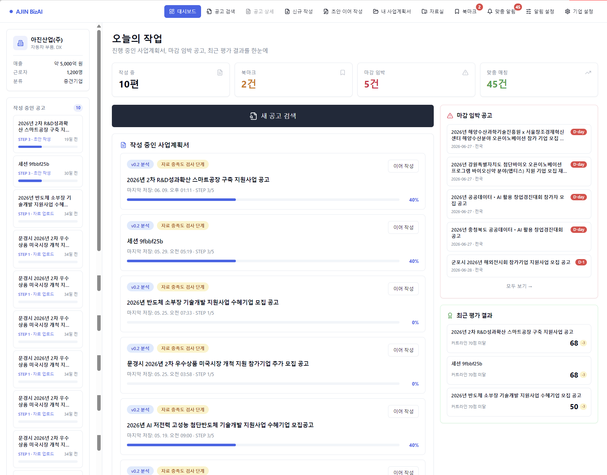
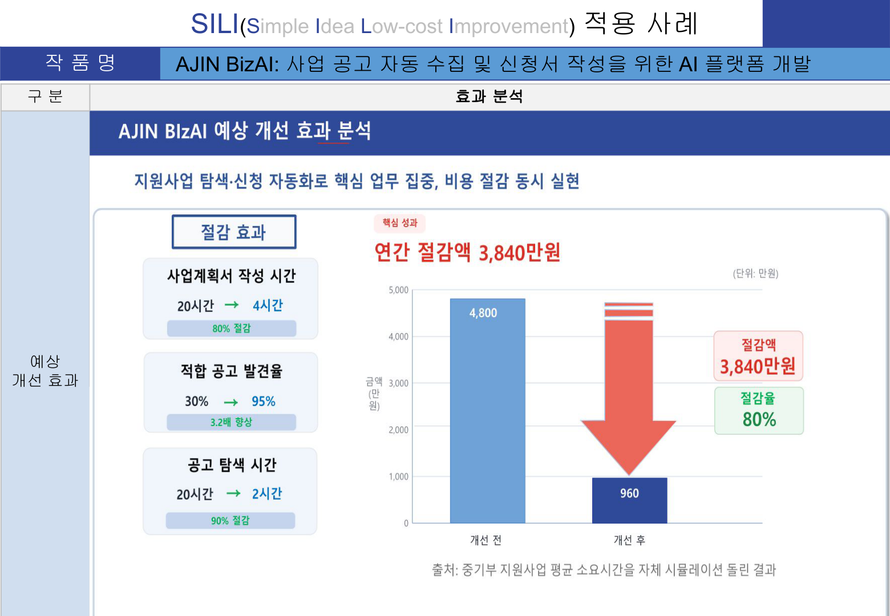
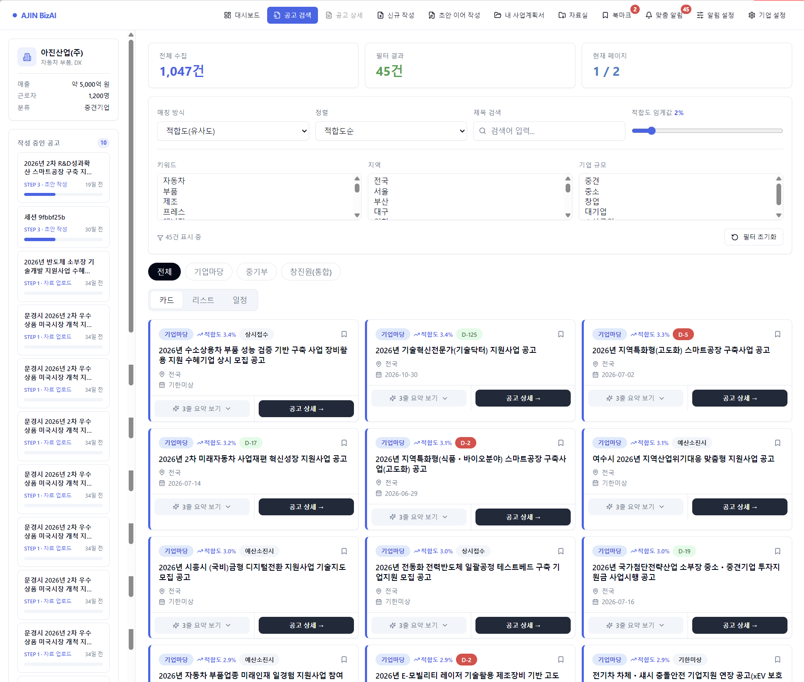
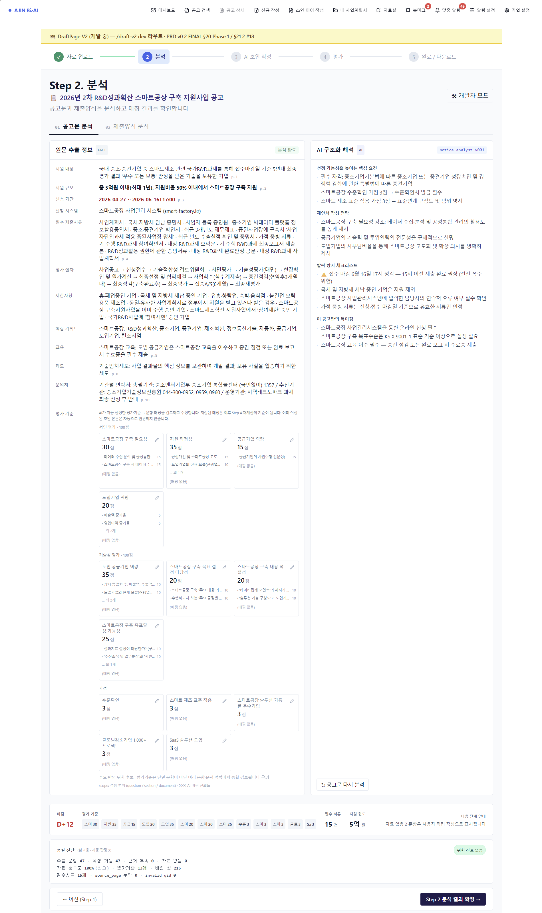
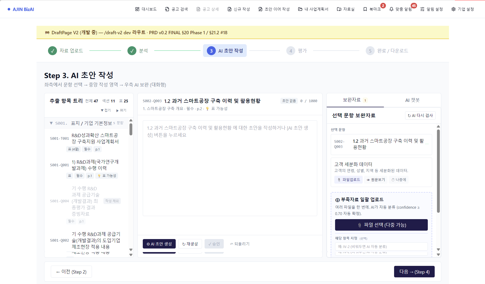
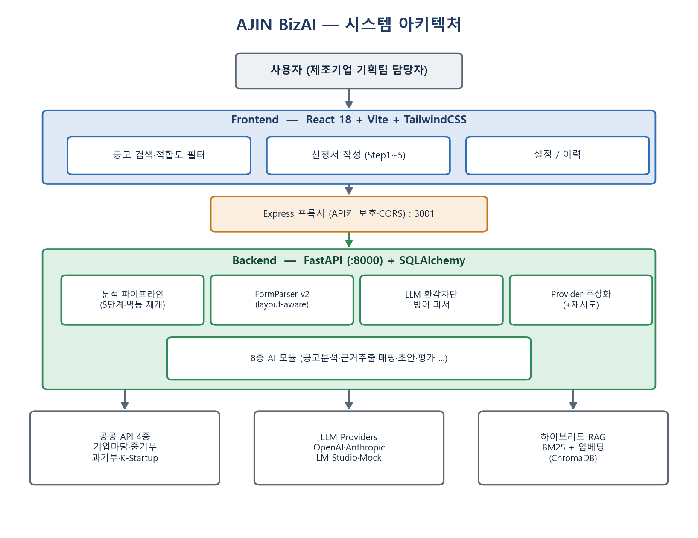
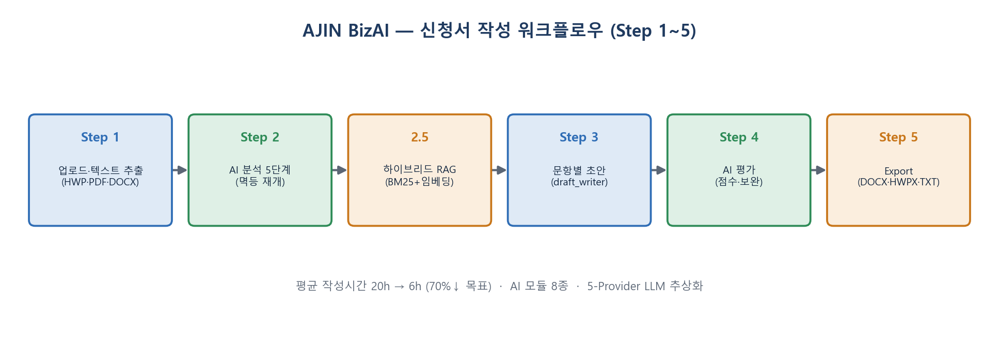

# AJIN BizAI

> **정부지원사업 신청서 자동화 SaaS**
> 공고 검색 → AI 분석 → 사업계획서 초안 작성 → 평가 → Export 까지 한 흐름으로 처리합니다.

🎬 **[▶️ 시연 영상 보기](https://drive.google.com/file/d/1T2TqIDPJeB4YkqqvK7BmgSZLANvfTY_6/view?usp=drive_link)**  ·  🏆 **KDT12 경진대회 본선 진출**



---

## 목차

- [프로젝트 소개](#프로젝트-소개)
- [화면 미리보기](#화면-미리보기)
- [주요 기능](#주요-기능)
- [기술 스택](#기술-스택)
- [시스템 아키텍처](#시스템-아키텍처)
- [폴더 구조](#폴더-구조)
- [빠른 시작](#빠른-시작)
- [환경변수 설정](#환경변수-설정)
- [테스트 실행](#테스트-실행)
- [기술적 도전 & 해결](#기술적-도전--해결)

---

## 프로젝트 소개

정부지원사업(R&D, 스마트공장 등) 공고문은 분량이 많고 형식이 제각각입니다.
한 기업이 적합한 공고를 찾고 사업계획서를 작성하는 데는 수십 시간이 걸립니다.

**AJIN BizAI**는 이 과정을 AI로 자동화합니다. 공고를 한곳에서 검색하고, 공고문·제출양식을 AI가 구조화한 뒤, 회사 자료를 근거로 문항별 초안을 작성하고 평가까지 한 흐름으로 연결합니다.

| 대상 | 설명 |
|------|------|
| 1차 사용자 | 중소·중견 제조기업 사업개발 담당자 |
| 2차 사용자 | 정부지원사업 컨설팅 회사 |



---

## 화면 미리보기

### 대시보드 — 오늘의 작업
작성 중인 사업계획서, 마감 임박 공고, 최근 평가 결과(커트라인 대비 점수)를 한 화면에서 확인합니다.


### 공고 검색 — 공공데이터 4종 통합
기업마당·과기부·중기부·K-Startup 공고를 통합 수집(1,000건+)하고, 적합도·지역·기업 규모 필터와 카드/리스트/일정 뷰, 마감일 임박순 정렬을 지원합니다. 각 카드에 AI 적합도와 D-day가 표시됩니다.



### Step 2. AI 분석 — 공고문 ↔ 구조화 해석
공고문 원문에서 추출한 정보(FACT)와 LLM이 구조화한 해석(지원 요건·제안서 전략·탈락 방지 체크리스트)을 나란히 보여주고, 평가기준을 자동 추출합니다. 추출 문항 수·자료 충족도 등 품질 진단도 함께 제공합니다.



### Step 3. AI 초안 작성 — 문항별 근거 기반 작성
추출 항목 트리(섹션·문항·표) → 중앙 작성 영역(AI 초안 생성·재생성·승인) → 우측 보완자료/AI 챗봇의 3-pane 구조로, 문항별로 회사 자료 근거를 매핑해 초안을 생성하고 inline 편집할 수 있습니다.



---

## 주요 기능

### 1. 공고 검색
공공데이터 API 4종(기업마당 / 과기부 / 중기부 / K-Startup)을 통합해 한 화면에 표시합니다.
키워드 / 지역 / 기업 규모 / AI 적합도 임계값 필터링, 마감일 임박순 정렬을 지원합니다.

### 2. AI 공고 분석
첨부파일(HWP/PDF)을 다운로드 → 텍스트 추출 → LLM 분류까지 자동으로 처리합니다.
지원대상 / 지원내용 / 제출서류 / 신청기간 / 유의사항 등 10개 항목으로 구조화합니다.

### 3. 제출양식 파싱 (FormParser v2)
업로드한 사업계획서 양식 PDF를 layout-aware 추출 → LLM이 섹션/문항/표 구조를 JSON 스키마로 변환합니다.
표는 cell 단위(header_cells + data_rows)까지 보존됩니다.

### 4. 참고자료 매핑
참고자료(회사소개서, 재무제표 등)에서 evidence를 추출하고
양식의 각 문항과 자동 매핑합니다 (BM25 + 임베딩 하이브리드).

### 5. AI 초안 작성
문항별로 draft_writer LLM이 evidence 기반 초안을 생성합니다.
사용자는 inline 편집이 가능합니다.

### 6. AI 평가
draft_evaluator LLM이 평가기준 매핑 + 점수 + 보완 제안을 출력합니다.

### 7. Export
완성된 초안을 DOCX / HWPX / TXT 형식으로 다운로드합니다.

---

## 기술 스택

| 영역 | 기술 |
|------|------|
| Frontend | React 18, Vite, Tailwind CSS, shadcn/ui, React Router 7 |
| Backend | FastAPI, SQLAlchemy 2, Pydantic 2, Python 3.13 |
| DB | SQLite, ChromaDB (벡터 저장) |
| LLM | OpenAI gpt-4o / gpt-4o-mini, Anthropic Claude, LM Studio (로컬 모델) |
| 파일 파싱 | pdfplumber, pypdfium2, python-docx, olefile (HWP 바이너리) |
| 검색 | rank-bm25 + chromadb 임베딩 하이브리드 |
| 테스트 | pytest, pytest-asyncio, Playwright (e2e), vitest |
| 배포 | Docker, Nginx, Express (production), Cloudflare Tunnel |

---

## 시스템 아키텍처



**Step 1~5 분석 워크플로우**



<details>
<summary>텍스트 다이어그램 보기</summary>

```
┌─────────────────────────────────────────────────────────────┐
│  Browser (React + Vite, port 5173)                          │
│  Proxy: /api → FastAPI | /proxy/lmstudio → LM Studio        │
└──────────────────────┬──────────────────────────────────────┘
                       │ HTTP
                       ▼
┌─────────────────────────────────────────────────────────────┐
│  FastAPI Backend (port 8000)                                │
│                                                             │
│  routers/                                                   │
│    analysis.py   — 5-step 분석 파이프라인                    │
│    notices.py    — 공고 검색 + AI 본문 분석                  │
│    files.py      — HWP/PDF 파싱 + HWPX export               │
│    library.py    — 자료실 (회사자료 / 참고자료 관리)          │
│                                                             │
│  services/                                                  │
│    ai_provider.py        — LLM 추상 계층                    │
│    form_parser_hybrid.py — 대형 PDF 청크 병렬 파싱           │
│    mapping_pipeline.py   — BM25 + 임베딩 매핑               │
│    lm_studio_client.py   — 로컬 LLM (reasoning 모델 대응)   │
└──────────────┬──────────────────────────┬───────────────────┘
               │                          │
               ▼                          ▼
   ┌───────────────────┐      ┌──────────────────────────┐
   │  SQLite + ChromaDB│      │  외부 LLM / 공공 API      │
   │  backend/ajin.db  │      │  OpenAI / Anthropic       │
   │  chroma_data/     │      │  기업마당 / 과기부 / 중기부 │
   └───────────────────┘      └──────────────────────────┘
```

</details>

### 데이터 흐름 (한 세션 기준)

```
Step 1  공고문 + 양식 + 참고자료 업로드
          └─ PDF/HWP/DOCX 텍스트 추출 → DB 영속화

Step 2  자동 분석 (병렬 실행)
          ├─ notice_analyst LLM  → 공고 구조화 (NoticeSchema)
          ├─ form_parser LLM     → 양식 구조화 (FormSchema)
          ├─ evidence_embedder   → ChromaDB 벡터 저장
          └─ mapping_pipeline    → 문항 ↔ Evidence 매칭

Step 3  문항별 초안
          └─ draft_writer LLM   → DraftItem (evidence 기반)

Step 4  AI 평가
          └─ draft_evaluator LLM → 점수 + 보완 제안

Step 5  Export
          └─ DOCX / HWPX / TXT 다운로드
```

---

## 폴더 구조

```
Ajin-BizAI/
├── backend/                  # FastAPI 서버
│   ├── main.py               # 앱 진입점, 라우터 등록
│   ├── models.py             # SQLAlchemy ORM 모델
│   ├── routers/              # API 엔드포인트 (12개)
│   ├── services/             # 비즈니스 로직 (25개+)
│   │   ├── ai_provider.py         # LLM 추상 계층 (OpenAI/Anthropic/LM Studio/Mock)
│   │   ├── form_parser_hybrid.py  # 대형 PDF 청크 병렬 파싱
│   │   ├── mapping_pipeline.py    # BM25 + 임베딩 매핑
│   │   └── lm_studio_client.py    # 로컬 LLM 클라이언트
│   ├── ontology/schemas.py   # Pydantic 스키마 11종
│   ├── prompts/              # LLM 시스템 프롬프트 (Markdown)
│   ├── hwpx/                 # HWP 읽기 / HWPX 생성 모듈
│   ├── migrations/           # idempotent DB 마이그레이션 5개
│   └── tests/                # pytest (40개+ 테스트)
│
├── web-react/                # React 프론트엔드
│   ├── src/
│   │   ├── App.jsx                    # 라우팅 + 전역 state
│   │   ├── api/                       # backend / LM Studio 클라이언트
│   │   ├── features/
│   │   │   ├── pages/draft-v2/        # 5-Step 워크플로 컴포넌트
│   │   │   ├── notices/               # 공고 검색 / 상세
│   │   │   └── layout/                # Sidebar, TopNav
│   │   └── components/ui/             # shadcn/ui 컴포넌트
│   ├── e2e/                  # Playwright e2e 테스트
│   ├── Dockerfile
│   └── docker-compose.yml
│
├── PRD/                      # 제품 요구사항 문서 (13개)
├── config/pricing.json       # LLM 비용 단가표
└── scripts/                  # 운영 유틸리티 스크립트
```

---

## 빠른 시작

### 사전 요구사항

| 도구 | 권장 버전 |
|------|----------|
| Python | 3.13 |
| Node.js | 18+ |
| Git | 2.40+ |

> Windows에서 Conda 가상환경 사용 시 SQLAlchemy 미설치 문제가 발생할 수 있습니다. system Python 사용을 권장합니다.

### 1. 저장소 클론

```bash
git clone https://github.com/KDT12-AJIN-PROJECT/Ajin-BizAI.git
cd Ajin-BizAI
```

### 2. 환경변수 설정

[환경변수 설정](#환경변수-설정) 섹션을 참고해 `.env` 파일을 구성합니다.

### 3. Backend 실행

```bash
cd backend
pip install -r requirements.txt
python -m uvicorn main:app --port 8000 --host 127.0.0.1
```

정상 기동 확인: `http://localhost:8000/api/health` → `{"status": "ok"}`

### 4. Frontend 실행

```bash
cd web-react
npm install
npm run dev
```

브라우저: `http://localhost:5173`

### 5. Docker로 전체 실행 (선택)

```bash
cd web-react
# web-react/.env.server 에 실제 키 입력 후
docker compose up --build
```

`http://localhost:8080` 접속.

---

## 환경변수 설정

### Backend (`backend/.env`)

```bash
cp backend/.env.example backend/.env
# 이후 backend/.env 편집
```

```ini
# LLM Provider: mock | openai | anthropic | local
AI_PROVIDER=openai

# OpenAI (https://platform.openai.com/api-keys)
OPENAI_API_KEY=sk-...
OPENAI_MODEL_ANALYSIS=gpt-4o-mini
OPENAI_MODEL_FORM_PARSER=gpt-4o
OPENAI_MODEL_DRAFT=gpt-4o-mini

# Anthropic (선택)
ANTHROPIC_API_KEY=sk-ant-...

# LM Studio 로컬 모델 (선택)
LM_STUDIO_URL=http://127.0.0.1:1234
LM_STUDIO_MODEL=google/gemma-4-e4b
LM_STUDIO_TOKEN=sk-lm-...

# 공공데이터 공고 API (data.go.kr 통합인증키 / 기업마당 키)
GONGGONG_API_KEY=...
BIZINFO_API_KEY=...

# DB & 서버
DATABASE_URL=sqlite:///./ajin.db
APP_ENV=development
```

> `AI_PROVIDER=mock` 으로 설정하면 API 키 없이도 전체 흐름을 테스트할 수 있습니다.

### Frontend (`web-react/.env`)

```bash
cp web-react/.env.example web-react/.env
```

```ini
VITE_API_BASE_URL=http://localhost:8000

# 공공데이터포털 API 키 (https://www.data.go.kr → 마이페이지 → 인증키 발급)
VITE_API_KEY=YOUR_PUBLIC_DATA_API_KEY

# 기업마당 API 키 (https://www.bizinfo.go.kr → API 활용신청)
VITE_BIZ_KEY=YOUR_BIZ_KEY
```

### Frontend Server (`web-react/.env.server`) — production 또는 LM Studio 사용 시

```ini
# ⚠️  이 파일은 .gitignore에 포함되어 있습니다. 절대 커밋하지 마세요.

API_KEY=YOUR_PUBLIC_DATA_API_KEY
BIZ_KEY=YOUR_BIZ_KEY

# LM Studio — LM Studio 실행 후 Server 탭 → API Key에서 생성
LM_STUDIO_TOKEN=YOUR_LM_STUDIO_TOKEN
LM_STUDIO_URL=http://127.0.0.1:1234

PORT=8080
```

---

## 테스트 실행

### Backend (pytest)

```bash
cd backend
python -m pytest tests/ -v
```

주요 테스트:
- `test_smoke_endpoints.py` — 전체 API 흐름 smoke 테스트
- `test_c3_mapping_pipeline.py` — BM25 + 임베딩 매핑 파이프라인
- `test_llm_response_parser.py` — LLM 응답 파싱 + 환각 ID 차단
- `test_table_normalizer.py` / `test_table_promoter.py` — 표 구조 파싱

### Frontend (vitest)

```bash
cd web-react
npm test
```

### E2E (Playwright)

```bash
cd web-react
npx playwright test
```

---

## 기술적 도전 & 해결

### HWP 바이너리 파싱
한국 정부 문서의 대부분이 `.hwp` 형식이지만 파이썬 공개 라이브러리의 지원이 불안정합니다.
OLE 컨테이너 파싱 → zlib 압축 해제 → UTF-16LE 레코드 추출을 직접 구현했습니다.
([`backend/hwpx/hwp_reader.py`](backend/hwpx/hwp_reader.py))

### 대형 PDF 양식 파싱 (Hybrid FormParser)
40페이지+ PDF는 단일 LLM 호출 시 TPM 한도를 초과합니다.
정규식 기반 챕터 분할 → 청크별 병렬 LLM 호출 → 결과 병합 방식으로 해결했습니다.
([`backend/services/form_parser_hybrid.py`](backend/services/form_parser_hybrid.py))

### LLM 환각 방지
LLM이 존재하지 않는 evidence ID를 참조하는 문제를 차단하는 검증 레이어를 구현했습니다.
JSON 코드펜스 자동 제거 + Pydantic 스키마 통과 검증으로 파이프라인 안정성을 확보했습니다.
([`backend/services/llm_response_parser.py`](backend/services/llm_response_parser.py))

### 다중 LLM Provider 추상화
OpenAI / Anthropic / LM Studio(로컬) / Mock을 단일 인터페이스로 추상화해
`.env` 변수 하나로 전환 가능하도록 설계했습니다.
작업 난이도별로 모델을 다르게 라우팅해 비용을 최적화합니다.
([`backend/services/ai_provider.py`](backend/services/ai_provider.py))

---

## 라이선스

[Apache 2.0](LICENSE)
